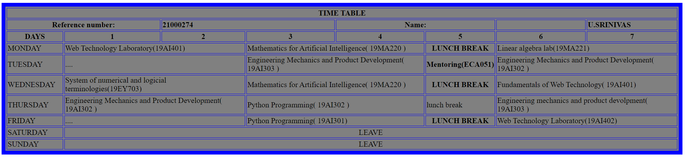

# Experiment_Time_Table

## AIM
To Write a html webpage page to display your timetable.

# ALGORITHM
### STEP 1
create a simple table using table tag
### STEP 2
Add header row using th tag
### STEP 3
Add your timetable
### STEP 4
Execute the program

# CODE
~~~
<html>

   <head>
      <title>TIME TABLE</title>
   </head>
	
   <body>
      <table border = "8" cellspacing="3" bordercolor="BLUE" bgcolor="GREY">
      <ing src="logo.png">
         <tr>
            <th colspan="8">TIME TABLE</th>
         </tr>
         <tr>
                <th colspan="2">Reference number:</th>
                <th colspan="2" align="left">21000274</th>
                <th colspan="2">Name:<th>
                <th colspan="2" align="left">U.SRINIVAS</th>
        <tr>
            <th>DAYS</th>
            <th>1</th>
            <th>2</th>
            <th>3</th>
            <th>4</th>
            <th>5</th>
            <th>6</th>
            <th>7</th>
            
            
        </tr>
        
      <tr>
             <td>MONDAY</td>
             <td colspan="2">Web Technology Laboratory(19AI401)</td>
             <td colspan="2">Mathematics for Artificial Intelligence( 19MA220 )</td>
	        <th rowspan="1">LUNCH BREAK</th>
             <td colspan="2">Linear algebra lab(19MA221)</td>
         </tr>
             <td>TUESDAY</td>
             <td colspan="2">....</td>
             <td colspan="2">Engineering Mechanics and Product Development( 19AI303 )</td>
             <th rowspan="1">Mentoring(ECA051)</td>
             <td colspan="2">Engineering Mechanics and Product Development( 19AI302 )</td>
        </tr>
  
  	     <td>WEDNESDAY</td>
             <td colspan="2">System of numerical and logicial terminologies(19EY703)</td>
             <td colspan="2">Mathematics for Artificial Intelligence( 19MA220 )</td></td>
             <th rowspan="1">LUNCH BREAK</th>
             <td colspan="2">Fundamentals of Web Technology( 19AI401) </td>
         </tr>
	     <td>THURSDAY</td>
             <td colspan="2">Engineering Mechanics and Product Development( 19AI302 )</td>
             <td colspan="2">Python Programming( 19AI302 )</td>
             <td colspan="1">lunch break</td>
             <td colspan="2">Engineering mechanics and product devolpment( 19AI303 )</td>
         </tr>  
	     <td>FRIDAY</td>
             <td colspan="2">....</td>
             <td colspan="2">Python Programming( 19AI301)</td>
             <th rowspan="1">LUNCH BREAK</th>
             <td colspan="2">Web Technology Laboratory(19AI402)</td>
          </tr>  
	     <td>SATURDAY</td>
             <td colspan="7" align="center">LEAVE</td> 
          </tr>  
	     <td>SUNDAY</td>
             <td colspan="7" align = "center">LEAVE</td>           
      </table>
   </body>
</html>
~~~
# OUPUT

